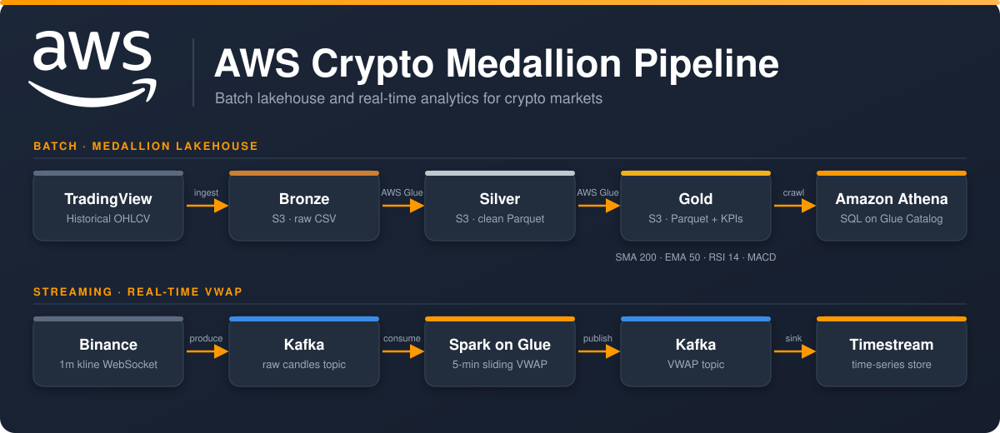
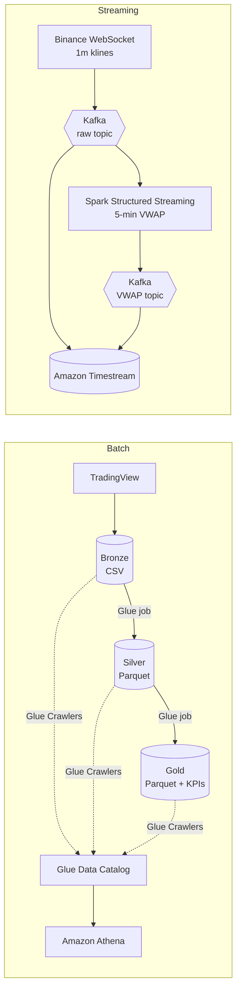

<p align="center">
  
</p>

<p align="center">
  
  
  
  
  
</p>

# AWS Crypto Medallion Pipeline

A cloud-native data platform that turns raw **cryptocurrency** market data into analytics-ready datasets, both **historically** and in **real time**.

Market data is only useful once it is clean, consistent and enriched. This project automates that journey on **AWS** with two complementary layers:

- **Batch layer** — ingests historical OHLCV prices from TradingView into an S3 data lake and refines them through a **Bronze → Silver → Gold** medallion architecture. The Gold layer adds technical indicators (SMA, EMA, RSI, MACD) and is queryable with SQL through Amazon Athena.
- **Streaming layer** — streams live 1-minute candles from Binance through Kafka, computes a rolling 5-minute **VWAP** with Spark Structured Streaming, and stores the results in Amazon Timestream.

The whole batch pipeline, including infrastructure setup, runs with a single command.

## Architecture



## Features

**Batch (Medallion lakehouse)**
- Downloads historical OHLCV data from TradingView and stores it as CSV, partitioned by `asset/year/month` (Bronze)
- Cleans and normalizes types and column names, writing Parquet (Silver)
- Computes technical indicators (Gold): **SMA 200**, **EMA 50**, **RSI 14**, **MACD** (line, signal, histogram)
- Catalogs every layer with a dedicated Glue Crawler, making it queryable from Athena
- One command (`run_all.py`) provisions the bucket, uploads the jobs, and runs the whole pipeline

**Streaming**
- Publishes closed 1-minute candles from Binance to Kafka
- Computes a 5-minute **VWAP** with Spark Structured Streaming (Glue streaming job)
- Persists raw quotes and VWAP in Amazon Timestream

## Repository layout

```
|
├── src/
│   ├── batch/
│   │   ├── run_all.py                  # One-command runner for the whole batch pipeline
│   │   ├── complete.py                 # Ingestion: TradingView -> S3 Bronze
│   │   ├── pipeline_launcher.py        # Creates Glue jobs/crawlers and runs them in order
│   │   ├── job_bronze_to_silver.py     # [Glue job] CSV -> clean Parquet
│   │   ├── job_silver_to_gold_kpis.py  # [Glue job] Parquet -> indicators
│   │   ├── job_run_crawler.py          # [Glue job] Runs a crawler from inside Glue
│   │   ├── constants.py                # Central configuration
│   │   ├── deletion_buckets.py         # Cleanup: delete project S3 buckets
│   │   ├── deletion_crawler.py         # Cleanup: delete crawlers and Glue database
│   │   └── TradingviewData/            # TradingView client (vendored, see Credits)
│   └── streaming/
│       ├── solusd_real_time.py         # Binance WebSocket -> Kafka
│       ├── kafka_simple_producer.py    # Producer helper
│       ├── SparkStreamingApp.py        # [Glue streaming job] 5-min VWAP
│       ├── kafka_simple_consumer.py    # Debug consumer for both topics
│       ├── timestream.py               # Kafka -> Amazon Timestream sink
│       └── kafka_config.py             # Kafka settings from environment variables
├── docs/                               # Sprint reports, user stories, EDA, Kafka cheat sheet
├── .env.example
└── requirements.txt
```

## Getting started

### Prerequisites

- Python 3.10+
- An AWS account with S3 and Glue access (AWS Academy works)
- Two IAM roles: one for Glue jobs (S3 + Glue) and one for Glue crawlers (S3 + Glue Catalog)
- For streaming: a Kafka broker with SASL/PLAIN authentication

### Installation

```bash
git clone https://github.com/andresgilvicente/aws-crypto-medallion-pipeline.git
cd aws-crypto-medallion-pipeline
python -m venv .venv && source .venv/bin/activate   # Windows: .venv\Scripts\activate
pip install -r requirements.txt
```

### Configuration

Copy `.env.example` to `.env`, fill it in, and export the variables (or set them in your shell):

```bash
export GLUE_JOB_ROLE_ARN="arn:aws:iam::<account-id>:role/<glue-job-role>"
export GLUE_CRAWLER_ROLE_ARN="arn:aws:iam::<account-id>:role/<glue-crawler-role>"
```

```powershell
$env:GLUE_JOB_ROLE_ARN = "arn:aws:iam::<account-id>:role/<glue-job-role>"
$env:GLUE_CRAWLER_ROLE_ARN = "arn:aws:iam::<account-id>:role/<glue-crawler-role>"
```

Pipeline settings live in [src/batch/constants.py](src/batch/constants.py):

| Variable | Default | Controls |
|----------|---------|----------|
| `REGION` | `eu-south-2` | AWS region |
| `BUCKET` | `trade-data-big-daddyks-main` | S3 data lake bucket (S3 names are global; change it) |
| `GLUE_DB` | `trade_data_imat3a05` | Glue Catalog database |
| `DEFAULT_ASSET` | `SOLUSD` | Fallback asset |

To ingest more assets, edit `ASSETS` in `src/batch/complete.py`, e.g. `["SOLUSD", "BTCUSD", "ETHUSD"]`.

## Usage

### Batch pipeline

```bash
cd src/batch
python run_all.py
```

This creates the bucket, uploads the Glue scripts, ingests TradingView data into Bronze, and runs:

```
Crawler Bronze -> Job Bronze -> Silver -> Crawler Silver -> Job Silver -> Gold -> Crawler Gold
```

Individual stages: `python complete.py` (ingestion only) and `python pipeline_launcher.py` (transformations only). A full run takes roughly 15–20 minutes.

### Streaming pipeline

```bash
export KAFKA_BOOTSTRAP_SERVERS="<host>:9092" KAFKA_USERNAME="..." KAFKA_PASSWORD="..."
cd src/streaming
python solusd_real_time.py     # Binance -> Kafka
python timestream.py           # Kafka -> Timestream (run on EC2)
```

`SparkStreamingApp.py` is deployed as an AWS Glue streaming job with the same three variables set as job environment variables. For broker administration, see the [Kafka CLI cheat sheet](docs/kafka-cli-cheatsheet.md).

### Querying with Athena

```sql
-- Clean data (Silver)
SELECT * FROM trade_data_imat3a05.lake_silver
WHERE asset = 'SOLUSD' AND year = 2025
LIMIT 10;

-- Indicators (Gold)
SELECT datetime, close, sma_200, ema_50, rsi_14, macd
FROM trade_data_imat3a05.lake_gold
WHERE asset = 'SOLUSD'
ORDER BY datetime DESC
LIMIT 20;
```

## Data lake layout

```
s3://<bucket>/
├── bronze/asset=SOLUSD/year=2024/month=01/data.csv
├── silver/asset=SOLUSD/year=2024/month=01/part-*.snappy.parquet
├── gold/asset=SOLUSD/year=2024/month=01/part-*.snappy.parquet   # + sma_200, ema_50, rsi_14, macd
└── scripts/                                                      # Glue job scripts
```

## Cleaning up

```bash
cd src/batch
python deletion_buckets.py   # delete S3 buckets (review the dry-run first)
python deletion_crawler.py   # delete crawlers and the Glue database
```

## Troubleshooting

- **`Session token expired`** — AWS Academy credentials expire after about an hour. Refresh and re-export them.
- **`GLUE_JOB_ROLE_ARN is empty`** — export both role ARNs before running.
- **`Partition does not match table schema`** — happens when one crawler spans several layers. The pipeline uses one crawler per layer; run `deletion_crawler.py` and retry.
- **No data from TradingView** — check connectivity; the symbol may not exist on `BINANCE`, or you may be rate-limited.

## Tech stack

| Concern | Technology |
|---------|-----------|
| Ingestion | TradingView API, Binance WebSocket (Python) |
| Storage | Amazon S3 (CSV → Parquet/Snappy) |
| Batch processing | AWS Glue 4.0 (Apache Spark 3.3) |
| Streaming | Apache Kafka, Spark Structured Streaming, Amazon Timestream |
| Catalog & query | Glue Data Catalog + Crawlers, Amazon Athena |

## Documentation

Project management artifacts from the agile development process are in [docs/](docs): [user stories](docs/user-stories.pdf), sprint reports ([1](docs/sprint-1.pdf), [2](docs/sprint-2.pdf), [3](docs/sprint-3.pdf), [4](docs/sprint-4.pdf), [5.1](docs/sprint-5-1.pdf), [5.2](docs/sprint-5-2.pdf), [6](docs/sprint-6.pdf)), and the [exploratory data analysis](docs/eda.pdf).

## Authors

Built as a team project at Universidad Pontificia Comillas (ICAI) by 

- Jorge Carnicero
- Jorge González
- Andrés Gil Vicente

The TradingView client in `src/batch/TradingviewData/` is based on [ravalmeet/TradingView-Data](https://github.com/ravalmeet/TradingView-Data).

## License

Released under the [MIT License](LICENSE).
